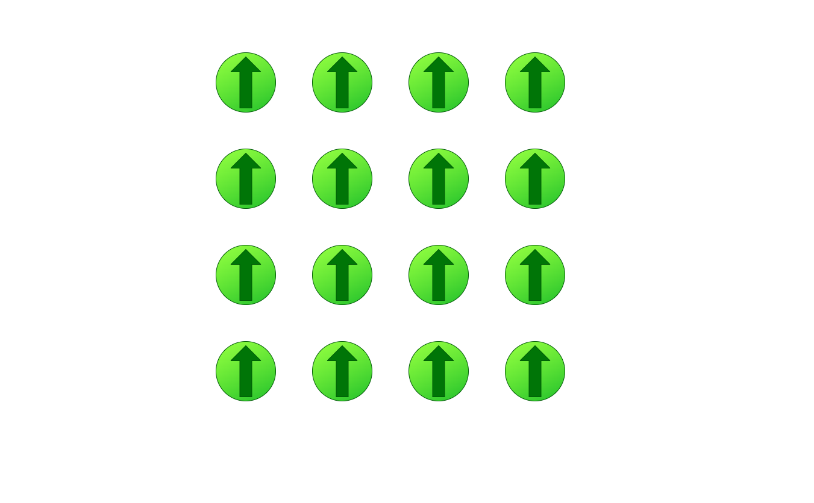

# What does it do?
This frontend application shows several arrow images which respond to the movements of cursor over them.
It was designed to show how to use builtin hooks to manage the state
# Installation

```bash
npm install
```

# Running application
Firstly run the application via the following command.
```bash
npm run start
```
Then run your browser and open [this](http://localhost:3000/) url

# Here you see a screenshot of the application

